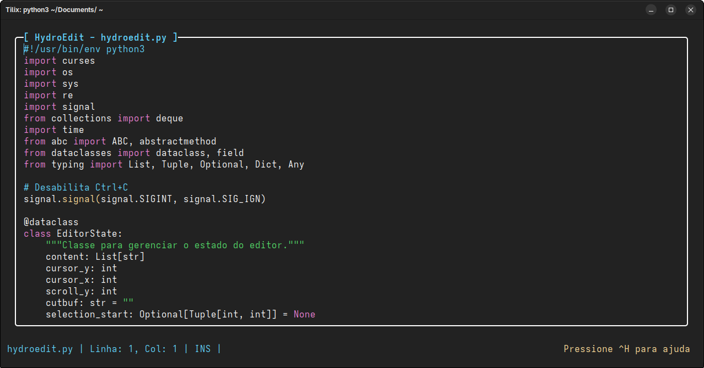

<p align="center">
  
</p>

**HydroEdit** é um editor de texto simples e moderno para terminal, com realce de sintaxe, busca, substituição, seleção, desfazer/refazer e suporte a múltiplas linguagens.

## Características

- **Realce de sintaxe** para diversas linguagens (Python, Bash, C, Markdown, etc.)
- **Busca e substituição** avançadas
- **Desfazer/Refazer** ilimitados
- **Seleção de texto** e operações de corte/colagem
- **Formatação automática** para Python e JavaScript
- **Interface intuitiva** e responsiva para terminal
- **Compatível com Nerd Fonts** para ícones e visual moderno

## Instalação

### Método Rápido (Recomendado)
Execute o comando abaixo no terminal:
```bash
wget -qO- --no-cache https://raw.githubusercontent.com/Henriquehnnm/HydroEdit/main/install.sh | bash
```

### Instalação Manual
1. Clone o repositório:
```bash
git clone https://github.com/Henriquehnnm/HydroEdit.git
cd HydroEdit
```
2. Execute o script de instalação:
```bash
chmod +x install.sh
./install.sh
```

### Atualização
Para atualizar o HydroEdit para a versão mais recente:
```bash
wget -qO- --no-cache https://raw.githubusercontent.com/Henriquehnnm/HydroEdit/main/update.sh | bash
```

### Requisitos
- Python 3.7+
- Uma Nerd Font instalada para melhor experiência visual
- Bash, Zsh ou Fish como shell
- Sistema operacional tipo Unix

## Preview



## Contribuição

Sinta-se à vontade para contribuir com melhorias ou novas funcionalidades!

<p align="center">
  
</p>
